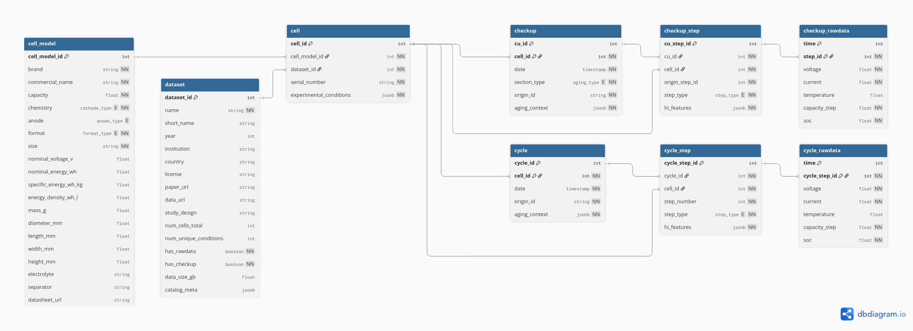

# Li-ion Cell Aging Metadata Catalog

[](https://doi.org/10.5281/zenodo.22944873)

A two-layer metadata standard for describing and storing Li-ion cell-level aging data.

Open aging datasets are released in many file formats, with experimental conditions described in free text and health metrics that cannot be compared across sources. This repository defines a common way to describe and organize them:

- **Catalog layer**: a JSON schema and controlled vocabulary that describe an aging dataset in four pillars: *dataset identity*, *cell identity*, *aging matrix* and *data availability*. It records the conditions that are usually buried in paper text, such as the reference performance test (RPT) temperature, C-rate and interval, so datasets can be discovered and compared without downloading them.
- **Measurement layer**: a database schema that defines how the aging measurements themselves are organized: RPT and cycling data as two parallel branches, segmented into typed steps, with the raw timeseries linked to each step.

Both layers share the same controlled vocabulary: any value valid in the catalog is valid in the database.

As a reference implementation, the repository includes catalog records for the open-source datasets reviewed in the paper.

## Repository structure

```
standard/                         The standard
├── catalog/                      Catalog layer (one JSON record per dataset)
│   ├── dataset_template.json         Empty record with every field and the controlled vocabularies
│   └── dataset_schema_reference.md   Description of every field, sub-object and vocabulary
└── database/                     Measurement layer (relational schema)
    ├── schema.sql                    PostgreSQL definition (9 tables, 5 enums)
    ├── schema.dbml                   Same schema in DBML (dbdiagram.io)
    ├── schema.png                    Entity-relationship diagram
    ├── database_doc.md               Description of every table, field and enum
    └── json_schemas/                 JSON schemas for the structured (JSONB) fields

datasets/                         Reference catalog (example application of the standard)
└── <year>_<institution>_<cell>.json  One catalog record per dataset
```

## Catalog layer

Each dataset is described by one JSON file following `standard/catalog/dataset_template.json`:

| Pillar | Main fields |
|---|---|
| Dataset identity | name, year, institution, country, license, paper and data URLs, citation |
| Cell identity | manufacturer, commercial name, form factor, cathode and anode chemistry, nominal capacity |
| Aging matrix | aging types, study design, temperatures, C-rates, SOC/DOD windows, time protocol |
| Data availability | recorded variables, file formats and structure, RPT types, reference conditions and interval |

Categorical fields take values from the controlled vocabularies in the `_controlled_vocabularies` section of the template (remove that section from individual records). Units are encoded in field names (`_ah`, `_v`, `_c`, `_pct`, ...). See `standard/catalog/dataset_schema_reference.md` for the full specification.

## Measurement layer

The database schema has nine tables: three core tables (`dataset`, `cell_model`, `cell`) and two parallel measurement branches from `cell`: `checkup` → `checkup_step` → `checkup_rawdata` for RPT and characterization sections, and `cycle` → `cycle_step` → `cycle_rawdata` for the aging cycle timeseries.



The `checkup` branch corresponds to the RPT branch described in the paper. See `standard/database/database_doc.md` for the table-by-table description.

## Adding a dataset

1. Copy `standard/catalog/dataset_template.json` and fill in the fields, using the controlled vocabularies.
2. Remove the `_controlled_vocabularies` section and save it as `datasets/<year>_<institution>_<cell>.json`.
3. Contributions of new records are welcome via pull request.

## Citation

If you use this standard or the catalog, please cite the paper above (DOI to be added on publication).

## License

See [LICENSE](LICENSE). The catalog records describe third-party datasets; the datasets themselves remain under their original licenses, listed in each record (`dataset_metadata.license`).
